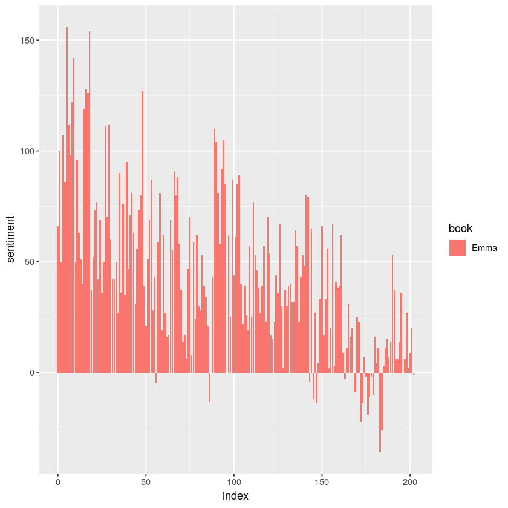
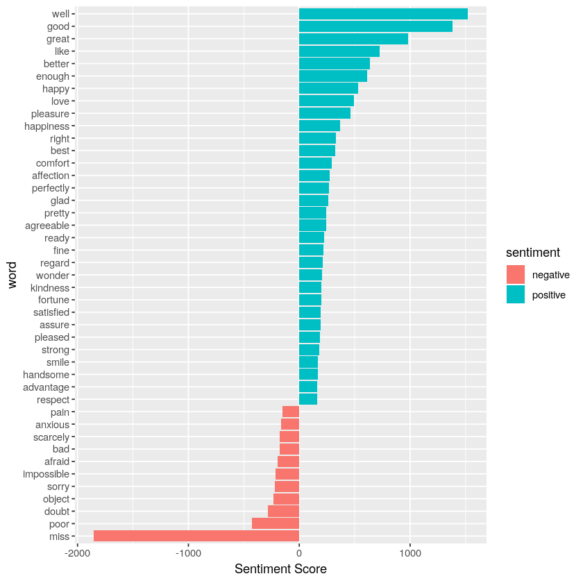
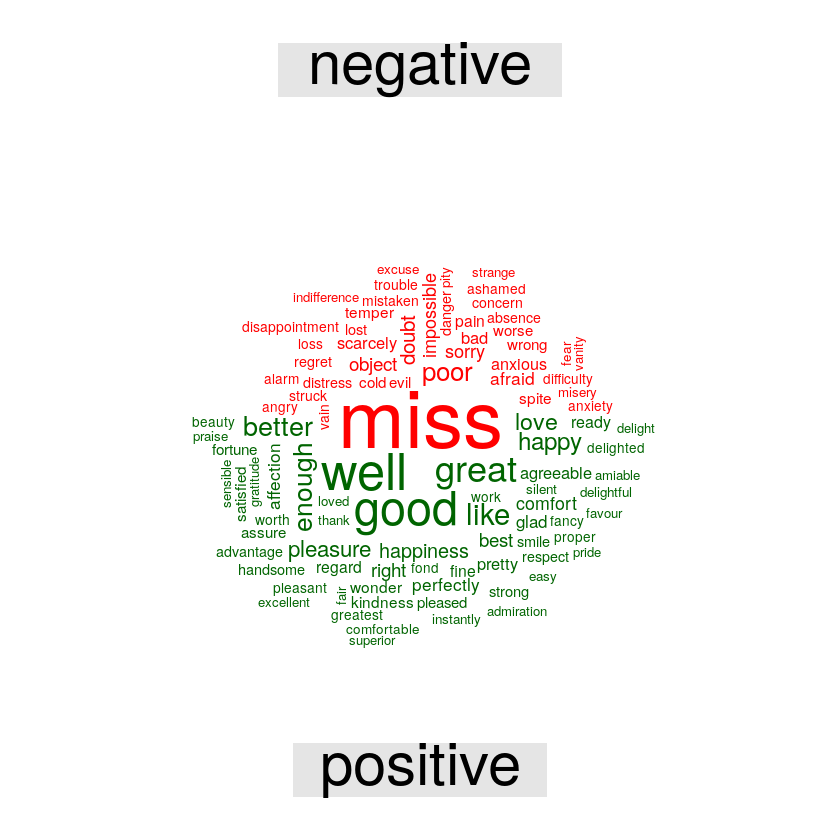

# Sentiment Analysis

Source: 

[1] https://data-flair.training/blogs/data-science-r-sentiment-analysis-project/

[2] https://www.tidytextmining.com/sentiment.html

> Sentiment analysis is the act of analyzing words to determine sentiments and opinions that may be positive or negative in polarity. This is a type of classification where the classes may be binary (positive and negative) or multiple (happy, angry, sad, disgusted,..). We’ll implement this data science project in the language R and use the dataset by the ‘janeaustenR’ package. We will use general-purpose bing, perform an inner join, and in the end, we’ll build a word cloud to display the result.


```R
# install important packages

install.packages('tidytext')
install.packages('janeaustenr')
install.packages('wordcloud')
```


```R
library(tidytext)

# take a look at the sentiment
head(sentiments)

# bing lexicon model 
head(get_sentiments('bing'))
```


<table>
<caption>A tibble: 6 × 2</caption>
<thead>
	<tr><th scope=col>word</th><th scope=col>sentiment</th></tr>
	<tr><th scope=col>&lt;chr&gt;</th><th scope=col>&lt;chr&gt;</th></tr>
</thead>
<tbody>
	<tr><td>2-faces   </td><td>negative</td></tr>
	<tr><td>abnormal  </td><td>negative</td></tr>
	<tr><td>abolish   </td><td>negative</td></tr>
	<tr><td>abominable</td><td>negative</td></tr>
	<tr><td>abominably</td><td>negative</td></tr>
	<tr><td>abominate </td><td>negative</td></tr>
</tbody>
</table>


<table>
<caption>A tibble: 6 × 2</caption>
<thead>
	<tr><th scope=col>word</th><th scope=col>sentiment</th></tr>
	<tr><th scope=col>&lt;chr&gt;</th><th scope=col>&lt;chr&gt;</th></tr>
</thead>
<tbody>
	<tr><td>2-faces   </td><td>negative</td></tr>
	<tr><td>abnormal  </td><td>negative</td></tr>
	<tr><td>abolish   </td><td>negative</td></tr>
	<tr><td>abominable</td><td>negative</td></tr>
	<tr><td>abominably</td><td>negative</td></tr>
	<tr><td>abominate </td><td>negative</td></tr>
</tbody>
</table>


# Load and preporcessing data

We going to use dataset provided in ```janeaustenr``` package, and do some preprocessing 


```R
# the load dataset package which will called latter by austen_book()
library(janeaustenr)
# stringr is for str_detect
library(stringr)

# library for processing dataframe: group_by, mutate, ungroup, unnest_tokens
library(dplyr)

tidy_data <- austen_books() %>% # using the janeausten package
    group_by(book) %>% # what is book here
    mutate(linenumber = row_number(), # what is mutate, what is row_number()
           # what is cumsum, what is str_detect, what does the regex used for
           chapter = cumsum(str_detect(text, regex('^chapter [\\divxcl]', 
                                                   ignore_case = TRUE
                                                  )))
          ) %>%
    ungroup() %>% # what is ungroup here
    unnest_tokens(word, text) # convert text into a tidy format
```

[Q] group_by(book) %>% # what is book here

[A] book is a column name in the passing in dataframe

--

[Q] what is mutate

[A] mutate create a new column, e.g., mutate(df, new_column = fn(exist_col) ). More info on mutate:

https://www.sharpsightlabs.com/blog/mutate-in-r/

--

[Q] what is row_number()

[A] this function will generate row number of dataframe

--

[Q] what is cumsum function

[A] this function will calucate accumulative sum, e.g., cumsum(1:4) = 1 3 6 10

--

[Q] what is str_detect function

[A] given str_detect(input, text_to_find) this function will return TRUE or FALSE whether text_to_find is found in the input. In the case here, str_detect(text, regex(...)) return one at the current row if chapter ... is found, otherwise, it returns 0. 


```R
# take a look at the tidy_data
head(tidy_data)
```


<table>
<caption>A tibble: 6 × 4</caption>
<thead>
	<tr><th scope=col>book</th><th scope=col>linenumber</th><th scope=col>chapter</th><th scope=col>word</th></tr>
	<tr><th scope=col>&lt;fct&gt;</th><th scope=col>&lt;int&gt;</th><th scope=col>&lt;int&gt;</th><th scope=col>&lt;chr&gt;</th></tr>
</thead>
<tbody>
	<tr><td>Sense &amp; Sensibility</td><td>1</td><td>0</td><td><span style=white-space:pre-wrap>sense      </span></td></tr>
	<tr><td>Sense &amp; Sensibility</td><td>1</td><td>0</td><td><span style=white-space:pre-wrap>and        </span></td></tr>
	<tr><td>Sense &amp; Sensibility</td><td>1</td><td>0</td><td>sensibility</td></tr>
	<tr><td>Sense &amp; Sensibility</td><td>3</td><td>0</td><td><span style=white-space:pre-wrap>by         </span></td></tr>
	<tr><td>Sense &amp; Sensibility</td><td>3</td><td>0</td><td><span style=white-space:pre-wrap>jane       </span></td></tr>
	<tr><td>Sense &amp; Sensibility</td><td>3</td><td>0</td><td><span style=white-space:pre-wrap>austen     </span></td></tr>
</tbody>
</table>


## Small test: Counting positive words in Emma book


```R
# filter only positive sentiment in 'bing' lexicon
positive_senti <- get_sentiments("bing") %>%
 filter(sentiment == "positive")

# filter for Emma book, exclude 'negative' sentiment and
count_positive_Emma <- tidy_data %>%
 filter(book == "Emma") %>%
 semi_join(positive_senti) %>% # what is semi_join
 count(word, sort = TRUE) # what is word here
```

    Joining, by = "word"
    


```R
head(positive_senti)
```


<table>
<caption>A tibble: 6 × 2</caption>
<thead>
	<tr><th scope=col>word</th><th scope=col>sentiment</th></tr>
	<tr><th scope=col>&lt;chr&gt;</th><th scope=col>&lt;chr&gt;</th></tr>
</thead>
<tbody>
	<tr><td>abound    </td><td>positive</td></tr>
	<tr><td>abounds   </td><td>positive</td></tr>
	<tr><td>abundance </td><td>positive</td></tr>
	<tr><td>abundant  </td><td>positive</td></tr>
	<tr><td>accessable</td><td>positive</td></tr>
	<tr><td>accessible</td><td>positive</td></tr>
</tbody>
</table>


```R
head(count_positive_Emma)
```


<table>
<caption>A tibble: 6 × 2</caption>
<thead>
	<tr><th scope=col>word</th><th scope=col>n</th></tr>
	<tr><th scope=col>&lt;chr&gt;</th><th scope=col>&lt;int&gt;</th></tr>
</thead>
<tbody>
	<tr><td>well  </td><td>401</td></tr>
	<tr><td>good  </td><td>359</td></tr>
	<tr><td>great </td><td>264</td></tr>
	<tr><td>like  </td><td>200</td></tr>
	<tr><td>better</td><td>173</td></tr>
	<tr><td>enough</td><td>129</td></tr>
</tbody>
</table>


[Q] what is semi_join here

[A] semi_join finds rows in the first table in which there are matches in first column (by default) of the two dfs.

[Q] what is count here

[A] count does the name implies, it counts the occurance in the given column (i.e. word) and the second argument sort is for sorting by frequency of the occurance.

# Calculate sentiment value

The idea is joining two dataframes - the given dataset and the sentiment dataset by finding matching words. In this way, we can find sentiment for each word in our dataset then find the difference of positive vs negative sentiment.

> In the next step, we will use spread() function to segregate our data into separate columns of positive and negative sentiments. We will then use the mutate() function to calculate the total sentiment, that is, the difference between positive and negative sentiment.

> We define an index here to keep track of where we are in the narrative; this index (using integer division) counts up sections of 80 lines of text. The %/% operator does integer division (x %/% y is equivalent to floor(x/y)) so the index keeps track of which 80-line section of text we are counting up negative and positive sentiment in.


```R
library(tidyr)
bing <- get_sentiments("bing")
Emma_sentiment <- tidy_data %>%
 inner_join(bing) %>% # what is inner_join
 # what is index, why index = floor of (linenumber / 80), what is 80 here
 count(book = "Emma" , index = linenumber %/% 80, sentiment) %>% 
 spread(sentiment, n, fill = 0) %>% # what is spread
 # what is positive, negative
 mutate(sentiment = positive - negative) # what does mutate do
 
```

    Joining, by = "word"
    


[Q] what is spread

[A] as demonstrated in the example below, spread will looking for keys in given column (i.e. sentiment and we have two keys: positive, negative), then new columns with new keys are added, the value of the new columns will be provided by argument value (i.e. n in this case), the missing values due to this spreading are filled with the fill option (i.e. fill=0).


```R
head(Emma_sentiment)
```


<table>
<caption>A tibble: 6 × 5</caption>
<thead>
	<tr><th scope=col>book</th><th scope=col>index</th><th scope=col>negative</th><th scope=col>positive</th><th scope=col>sentiment</th></tr>
	<tr><th scope=col>&lt;chr&gt;</th><th scope=col>&lt;dbl&gt;</th><th scope=col>&lt;dbl&gt;</th><th scope=col>&lt;dbl&gt;</th><th scope=col>&lt;dbl&gt;</th></tr>
</thead>
<tbody>
	<tr><td>Emma</td><td>0</td><td>130</td><td>196</td><td> 66</td></tr>
	<tr><td>Emma</td><td>1</td><td>130</td><td>230</td><td>100</td></tr>
	<tr><td>Emma</td><td>2</td><td>135</td><td>185</td><td> 50</td></tr>
	<tr><td>Emma</td><td>3</td><td>138</td><td>245</td><td>107</td></tr>
	<tr><td>Emma</td><td>4</td><td>141</td><td>227</td><td> 86</td></tr>
	<tr><td>Emma</td><td>5</td><td> 98</td><td>254</td><td>156</td></tr>
</tbody>
</table>


```R
library(ggplot2)

ggplot(Emma_sentiment, aes(index, sentiment, fill=book)) +
 # what is 'identity'
 geom_bar(stat = "identity", show.legend = TRUE) 
 # what does facet_wrap do, what ~book means
 # facet_wrap(~book, ncol = 2, scales = "free_x")
```





[Q] what is 'stat=`identity`'

[A] By default geom_bar() uses stat_count() to plot the frequency of cases at each level of x (some grouping variable). By contrast, this can be overridden with stat_identity() by supplying the argument stat = "identity" to plot the value at each level of x. The reason being geom_bar() is intended to plot frequencies, otherwise a single value could be more efficiently represented by a single point.

For more info: https://stackoverflow.com/questions/59008974/why-is-stat-identity-necessary-in-geom-bar-in-ggplot


```R
counting_words <- tidy_data %>%
 inner_join(bing) %>%
 count(word, sentiment, sort = TRUE)
head(counting_words)
```

    Joining, by = "word"
    


<table>
<caption>A tibble: 6 × 3</caption>
<thead>
	<tr><th scope=col>word</th><th scope=col>sentiment</th><th scope=col>n</th></tr>
	<tr><th scope=col>&lt;chr&gt;</th><th scope=col>&lt;chr&gt;</th><th scope=col>&lt;int&gt;</th></tr>
</thead>
<tbody>
	<tr><td>miss  </td><td>negative</td><td>1855</td></tr>
	<tr><td>well  </td><td>positive</td><td>1523</td></tr>
	<tr><td>good  </td><td>positive</td><td>1380</td></tr>
	<tr><td>great </td><td>positive</td><td> 981</td></tr>
	<tr><td>like  </td><td>positive</td><td> 725</td></tr>
	<tr><td>better</td><td>positive</td><td> 639</td></tr>
</tbody>
</table>


```R
counting_words %>%
 filter(n > 150) %>%
 # what is -n, n, what ifelse means, what mutate here
 mutate(n = ifelse(sentiment == "negative", -n, n)) %>%
 mutate(word = reorder(word, n)) %>% # what mutate does here
 ggplot(aes(word, n, fill = sentiment))+
 geom_col() +
 coord_flip() + # why
 labs(y = "Sentiment Score")
```





```R
library(reshape2)
library(wordcloud)
tidy_data %>%
 inner_join(bing) %>%
 count(word, sentiment, sort = TRUE) %>%
 # what is acast, what is word ~ sentiment
 acast(word ~ sentiment, value.var = "n", fill = 0) %>%
 comparison.cloud(colors = c("red", "dark green"),
          max.words = 100) # what is max.words
```

    Loading required package: RColorBrewer
    
    Joining, by = "word"
    





# Questions
[1] What is lexicons?

[A] lexicon means vocalulary

--

[2] What is bing?


[A]
> There are a variety of methods and dictionaries that exist for evaluating the opinion or emotion in text. The tidytext package provides access to several sentiment lexicons. Three general-purpose lexicons are
>- AFINN from Finn Årup Nielsen,
>- bing from Bing Liu and collaborators, and
>- nrc from Saif Mohammad and Peter Turney.`
